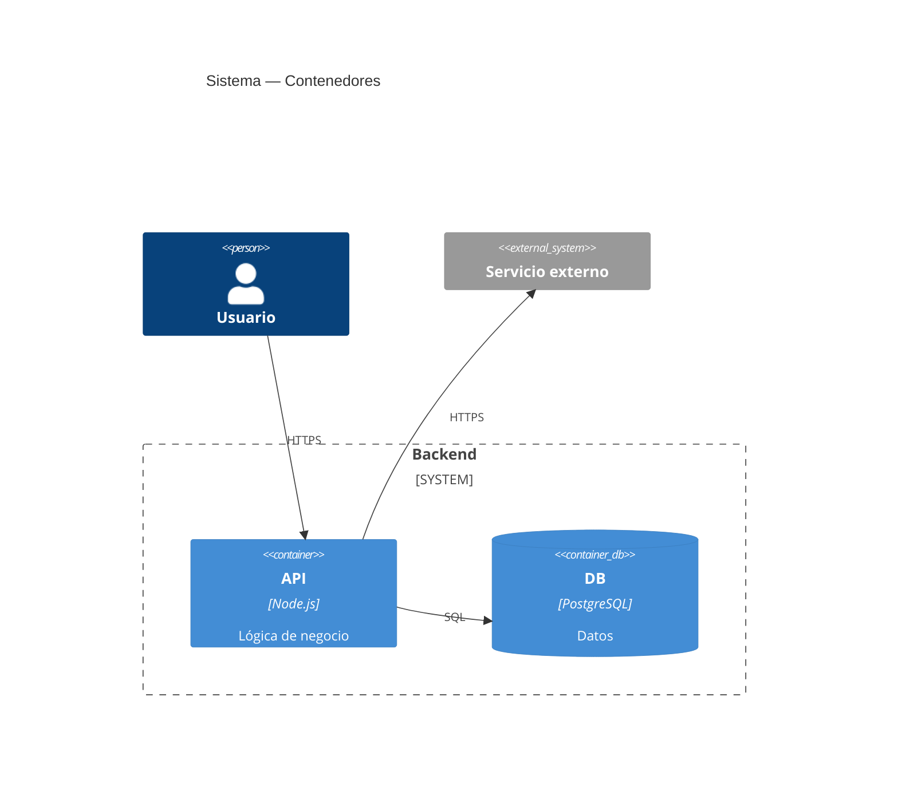
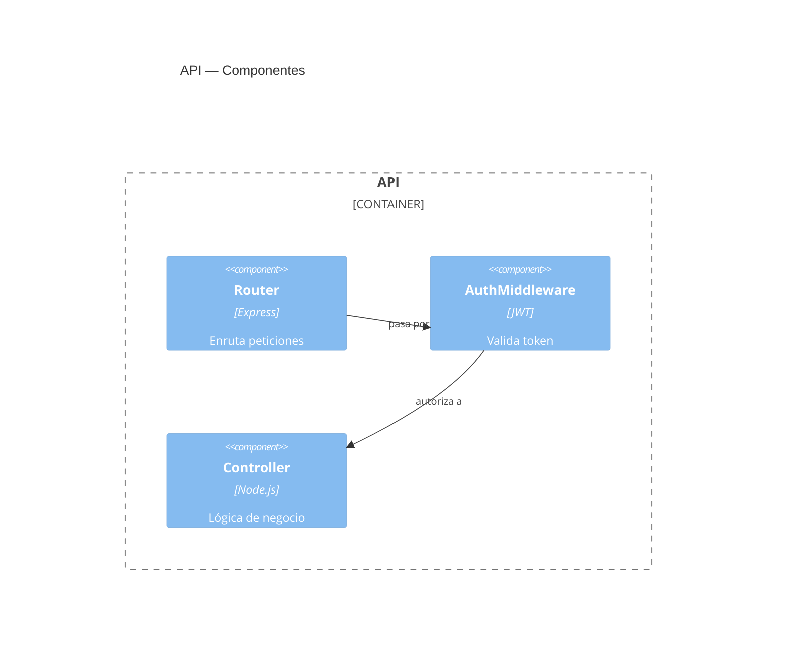
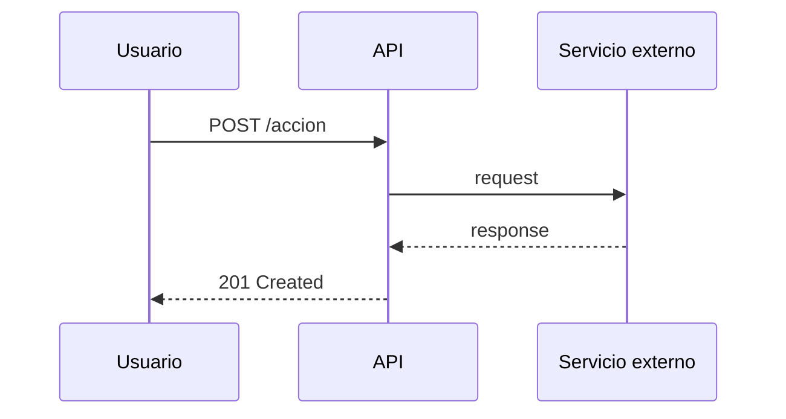
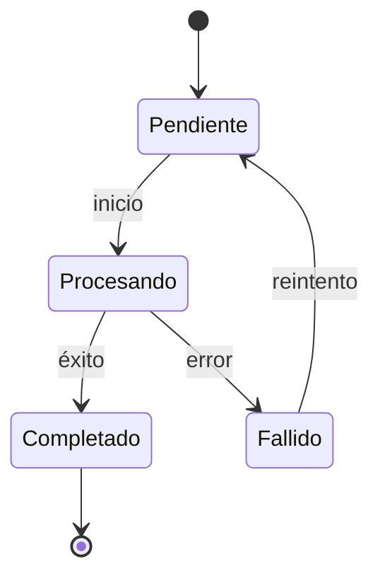

# Reference: Diagramas C4 y Flexibilidad

## Criterio de Selección

| Situación | Tipo recomendado |
|-----------|-----------------|
| Nuevo servicio o módulo, vista de despliegue | C4 Nivel 2 (Contenedores) |
| Dependencias internas de un componente | C4 Nivel 3 (Componentes) |
| Flujo de llamadas entre servicios, orden importa | Secuencia |
| Ciclo de vida de una entidad, transiciones condicionales | Estado |

**Regla:** si C4 requiere notas para explicar el flujo, usa Secuencia o Estado en su lugar.

## C4 Nivel 2 — Contenedores

Ruta de persistencia: `/docs/architecture/c4-containers.md`

## C4 Nivel 3 — Componentes

Ruta de persistencia: `/docs/architecture/c4-components-<nombre>.md`

## Secuencia — cuando el orden de llamadas importa

## Estado — cuando hay ciclo de vida con transiciones

